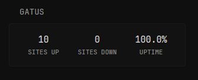

```yaml
- type: custom-api
  title: Gatus
  cache: 1m
  url: ${GATUS_URL}/api/v1/endpoints/statuses
  template: |
    {{ $up := 0 }}
    {{ $down := 0 }}
    {{ $totalChecks := 0 }}
    {{ $successfulChecks := 0 }}
    {{ range .JSON.Array "" }}
      {{ $results := .Array "results" }}
      {{ $totalChecks = add $totalChecks (len $results) }}
      {{ range $results }}
        {{ if .Bool "success" }}
          {{ $successfulChecks = add $successfulChecks 1 }}
        {{ end }}
      {{ end }}
      {{ if gt (len $results) 0 }}
        {{ $latestResult := index $results (sub (len $results) 1) }}
        {{ if $latestResult.Bool "success" }}
          {{ $up = add $up 1 }}
        {{ else }}
          {{ $down = add $down 1 }}
        {{ end }}
      {{ end }}
    {{ end }}
    {{ $uptime := 0 }}
    {{ if gt $totalChecks 0 }}
      {{ $uptime = div (mul $successfulChecks 1000) $totalChecks }}
    {{ end }}
    <div style="display: grid; grid-template-columns: 1fr 1fr 1fr; gap: 10px; text-align: center;">
      <div>
        <div class="size-h3 color-highlight">{{ $up }}</div>
        <div class="size-h6">SITES UP</div>
      </div>
      <div>
        <div class="size-h3 color-highlight">{{ $down }}</div>
        <div class="size-h6">SITES DOWN</div>
      </div>
      <div>
        <div class="size-h3 color-highlight">{{ div $uptime 10.0 | printf "%.1f" }}%</div>
        <div class="size-h6">UPTIME</div>
      </div>
    </div>

```

## Environment variables

- `GATUS_URL`: The url of your Gatus instace (no slash on the end). For example, `http://gatus:8080`
