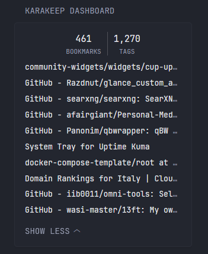

# Karakeep Dashboard
- The widget returns statistics on the number of bookmarks and the number of tags and the most recently added bookmarks.



```yaml
- type: custom-api
  title: Karakeep Dashboard
  cache: 30m
  method: GET
  options:
    limit: 10            # Number of bookmarks to fetch and display
    collapse-after: 6    # Number of bookmarks after which list collapses
    in-new-tab: true     # Open bookmark links in a new tab if true
  headers:
    Authorization: Bearer ${KARAKEEP_API_KEY}
    Accept: application/json
  url: https://${KARAKEEP_URL}/api/v1/users/me/stats   # API endpoint for user stats
  template: |
    {{/* Display user stats fetched from the specified URL */}}
    <div class="flex justify-center gap-10 text-center" style="margin-bottom:1rem;">
      <div>
        <div class="color-highlight size-h3">{{ .JSON.Int "numBookmarks" | formatNumber }}</div>
        <div class="size-h6">BOOKMARKS</div>
      </div>
      {{/* Vertical separator between stats */}}
      <div style="width:1px; height:40px; background-color: rgba(255,255,255,0.2);"></div>
      <div>
        <div class="color-highlight size-h3">{{ .JSON.Int "numTags" | formatNumber }}</div>
        <div class="size-h6">TAGS</div>
      </div>
    </div>

    {{/* Fetch the latest bookmarks using newRequest inside the template */}}
    {{ $limit := .Options.IntOr "limit" 10 }}
    {{ $collapseAfter := .Options.IntOr "collapse-after" 6 }}
    {{ $newTab := .Options.BoolOr "in-new-tab" false }}
    {{ $urlBookmarks := printf "https://%s/api/v1/bookmarks?limit=%d" "${KARAKEEP_URL}" $limit }}

    {{ $respBookmarks := newRequest $urlBookmarks
      | withHeader "Authorization" (printf "Bearer %s" "${KARAKEEP_API_KEY}")
      | withHeader "Accept" "application/json"
      | getResponse }}
    {{ $bookmarks := $respBookmarks.JSON.Array "bookmarks" }}

    {{/* Display bookmarks in a collapsible list */}}
    <ul class="list list-gap-10 collapsible-container" data-collapse-after="{{ $collapseAfter }}" style="max-width: 100%; overflow-x: hidden; font-size: 1em; line-height: 1.3em; padding-left: 0; margin: 0;">
      {{ range $b := $bookmarks }}
        {{ $content := $b.Get "content" }}
        {{ $title := $content.String "title" }}
        {{ $url := $content.String "url" }}

        {{/* Limit displayed title length to avoid UI issues, add ellipsis if truncated */}}
        {{ $maxLength := 60 }}
        {{ $displayTitle := $title }}
        {{ if gt (len $title) $maxLength }}
          {{ $displayTitle = print (slice $title 0 $maxLength) "…" }}
        {{ end }}

        <li style="list-style: none; white-space: nowrap; overflow: hidden; text-overflow: ellipsis;">
          <a href="{{ $url }}"
             title="{{ $title }}"  {{/* Full title on hover */}}
             {{ if $newTab }} target="_blank" rel="noopener"{{ end }}
             class="color-highlight"  {{/* Highlighted link color */}}
             style="text-decoration: none; cursor: pointer;">
            {{ $displayTitle }}
          </a>
        </li>
      {{ end }}
    </ul>
```

## Environment variables
- `KARAKEEP_URL` - karakeep.domain.com or localhost (If you connect via localhost, remember to change the connection protocol from https to http.) 
- `KARAKEEP_API_KEY` - Your API key generated in Karakeep.

## Options

| Option          | Description                                   | Values             |
|-----------------|-----------------------------------------------|--------------------|
| `limit`         | Number of latest bookmarks to list            | 10, 20, or 30      |
| `in-new-tab`    | Open links in a new browser tab                | `true` or `false`  |
| `collapse-after`| Collapse list after this many items            | Integer (e.g. 5,10)|
| `cache`         | Cache time                                     | 30m, 60m, 1d       |
